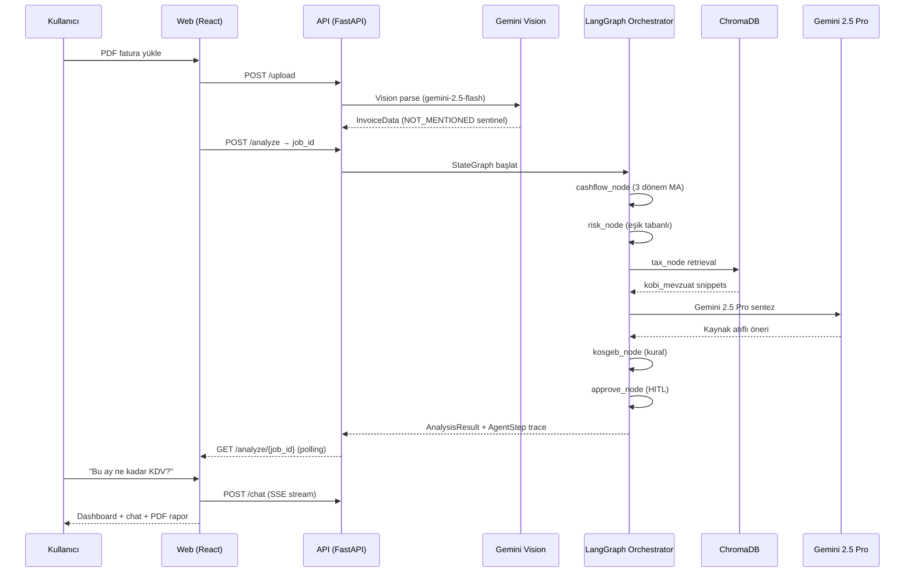

<div align="center">

# KOBİ Advisor

**Türkiye KOBİ'leri için Yapay Zeka Destekli AI CFO**

[](BTK-2026.pdf)
[](apps/api)
[](apps/web)
[](apps/api)
[](apps/web)
[](https://ai.google.dev/gemini-api)
[](https://langchain-ai.github.io/langgraph/)
[](https://www.trychroma.com/)
[](https://supabase.com)

*Fatura PDF → ayrıştırma → 4 ajanlı analiz → dashboard + Türkçe sohbet + kaynak atıflı PDF rapor*

</div>

---

## İçindekiler

- [Proje hakkında](#proje-hakkında)
- [Örnek kullanım senaryosu](#örnek-kullanım-senaryosu)
- [Temel özellikler](#temel-özellikler)
- [Mimari](#mimari)
- [Ajan pipeline'ı](#ajan-pipelineı)
- [Teknoloji stack](#teknoloji-stack)
- [Proje yapısı](#proje-yapısı)
- [Kurulum](#kurulum)
- [Demo senaryoları](#demo-senaryoları)
- [API özeti](#api-özeti)
- [v1 (MVP) ve v2 (multi-tenant)](#v1-mvp-ve-v2-multi-tenant)
- [Testler](#testler)
- [Dokümantasyon](#dokümantasyon)
- [Hackathon faz planı](#hackathon-faz-planı)
- [Bilinen sınırlamalar](#bilinen-sınırlamalar)
- [Ekip](#ekip)
- [Lisans](#lisans)

---

## Proje hakkında

**KOBİ Advisor**, Türkiye'deki küçük ve orta ölçekli işletmelerin fatura tabanlı verilerini yapay zeka ile yapısal analize dönüştürerek, profesyonel mali müşavire erişimi olmayan girişimcilere **anlaşılır, kaynak atıflı ve uygulanabilir** finansal içgörü sunan bir AI CFO platformudur.

### Proje özeti

- **Proje adı:** KOBİ Advisor
- **Amaç:** Fatura PDF'lerini saniyeler içinde yapısal veriye dönüştürmek; Türk vergi mevzuatına (GVK, KDV, SGK, VUK) dayalı RAG ile vergi yükümlülüklerini açıklamak; nakit akışını tahmin etmek; risk sinyalleri üretmek ve kaynak atıflı önerilerle indirilebilir PDF raporu sunmak.
- **Çözdüğü sorun:** Türkiye'de yaklaşık **3,5 milyon KOBİ**'nin büyük çoğunluğu profesyonel mali müşavire düzenli erişemiyor. Nakit, vergi (KDV/SGK/gelir vergisi) ve teşvik takibi manuel veya reaktif kalıyor. KOBİ Advisor bu süreci **agentic** ve **şeffaf** bir mimaride otomatikleştirir.
- **Hedef kitle:** Şahıs şirketi sahipleri, küçük işletme yöneticileri, esnaflar, mali müşavirlerine ek bir "second-opinion" katmanı isteyen serbest meslek erbabı.

### Hackathon bağlamı

[BTK Hackathon'26 · Finans](BTK-2026.pdf) kapsamında **9–19 Mayıs 2026** arasında geliştirilmiştir. Jüri kriterleri: kullanıcı değeri, agentic yapılar, teknik mimari, UX ve çalışan demo. Büyük dil modeli olarak **Gemini** kullanımı hackathon şartıdır.

---

## Örnek kullanım senaryosu

**Kullanıcı:** Ahmet Usta, küçük bir fırın işletmecisi. Geçen 6 ayın faturalarını PDF olarak biriktirdi ve KDV dönemine yaklaşırken nakit dengesini merak ediyor.

**KOBİ Advisor süreci:**

1. **PDF yükleme** — Kullanıcı 6 aylık fatura setini sürükle-bırak ile yükler.
2. **Vision ayrıştırma** — Gemini 2.5 Flash, her faturayı `InvoiceData`'ya çevirir; eksik alanlar `NOT_MENTIONED` sentinel'i ile işaretlenir.
3. **Onboarding** — Şirket türü (Şahıs / Limited), sektör (Gıda & İçecek), dönem aralığı seçilir.
4. **LangGraph orchestrator** — 4 özelleşmiş ajan sırayla çalışır: nakit akışı → risk → mevzuat RAG → KOSGEB → onay kapısı.
5. **Dashboard** — KPI kartları, nakit akışı grafiği, trafik ışığı risk paneli, kaynak atıflı vergi önerileri, KOSGEB uygunluk listesi ve **adım adım ajan trace'i**.
6. **Sohbet** — *"Bu ay ne kadar KDV ödeyeceğim?"* gibi sorular SSE stream ile yanıtlanır.
7. **PDF rapor** — ReportLab ile indirilebilir, kaynak atıflı, paylaşılabilir rapor.

**Beklenen içgörü:** Kasım ayı stok yüklemesinden kaynaklı nakit baskısı; risk panelinde sarı/kırmızı uyarı; KDV beyan tarihi yaklaşırken proaktif uyarı.

---

## Temel özellikler

### Yapay zeka yetenekleri

- **Gemini Vision PDF ayrıştırma** — `gemini-2.5-flash`, sıcaklık 0; eksik alanlar için `NOT_MENTIONED` sentinel sözleşmesi (`None`, `""`, `"N/A"` kabul edilmez).
- **LangGraph multi-agent orchestrator** — 4 özelleşmiş ajan + HITL onay düğümü; `AgentStep` trace'i UI'da panel olarak gösterilir.
- **Gemini 2.5 Pro sentez** — sıcaklık 0.3; mevzuat snippet'lerini kaynak atıflı, **güven skorlu** önerilere dönüştürür.

### RAG (Türk vergi mevzuatı)

- **17+ resmi belge** — GVK, KDV, SGK, VUK ve ilgili tebliğler (`apps/api/data/rag/SOURCES.md`).
- **ChromaDB kalıcı koleksiyon** — `kobi_mevzuat`; HTTP modunda docker-compose servisine bağlanır.
- **gemini-embedding-2 (1536d MRL)** — `RETRIEVAL_DOCUMENT` / `RETRIEVAL_QUERY` task ayrımı.
- **Atıflı sentez** — her öneri ilgili madde numarasını ve 1–5 arası güven skorunu içerir.

### Dashboard ve etkileşim

- **KPI kartları** ve **Recharts** ile nakit akışı grafiği.
- **Trafik ışığı risk paneli** — eşik tabanlı (gelir ↓ %20/%40, gider ↑ %30/%50, üst üste 2 ay negatif nakit).
- **Türkçe sohbet** — analiz bağlamına bağlı SSE stream.
- **PDF rapor** — ReportLab; v2'de HITL onay kapısı.
- **Ajan trace paneli** — *"Ajan ne yapıyor?"*: her adım canlı şeffaflıkla gösterilir.

### v2 SaaS iskeleti

- **Supabase Auth + Postgres RLS** — service-role + middleware'de zorunlu `tenant_id` enjeksiyonu, repository katmanında explicit filter.
- **Multi-tenant RAG** — tenant koleksiyonu + global mevzuat.
- **Ek modüller** — banka ekstresi içe aktarımı, vergi takvimi, iyzico sanal POS webhook'u.

---

## Mimari

```
┌─────────────────────────────────────────────────────────────────────────┐
│                         Kullanıcı (tarayıcı)                             │
└─────────────────────────────────┬───────────────────────────────────────┘
                                  │ REST / SSE
┌─────────────────────────────────▼───────────────────────────────────────┐
│  apps/web — React 18 + TypeScript + Vite + Tailwind                      │
│  · v1: /  → upload → onboarding → /dashboard/:jobId                      │
│  · v2: /:slug/dashboard | integrations | tax-calendar | pos               │
└─────────────────────────────────┬───────────────────────────────────────┘
                                  │
┌─────────────────────────────────▼───────────────────────────────────────┐
│  apps/api — FastAPI 0.115 + Pydantic v2                                  │
│  ┌──────────────┐  ┌─────────────────────────────────────────────────┐  │
│  │ /upload      │  │ LangGraph Orchestrator (agents/orchestrator.py)   │  │
│  │ /analyze     │  │  cashflow → risk → tax_rag → kosgeb → approve    │  │
│  │ /chat (SSE)  │  └───────────┬─────────────────────────────────────┘  │
│  │ /report      │              │                                         │
│  │ /v2/{slug}/* │              ▼                                         │
│  └──────────────┘  ┌──────────┐ ┌──────────┐ ┌────────────┐ ┌─────────┐ │
│                    │ Nakit    │ │ Risk     │ │ Mevzuat    │ │ KOSGEB  │ │
│                    │ Akışı    │ │ (kural)  │ │ RAG        │ │ (kural) │ │
│                    └──────────┘ └──────────┘ └─────┬──────┘ └─────────┘ │
└──────────────────────────────────────┬──────────────┼──────────────────────┘
                                       │              │
                    ┌──────────────────▼──┐    ┌──────▼──────┐
                    │ Gemini 2.5 Flash    │    │ ChromaDB    │
                    │ (Vision parse)      │    │ HTTP :8001  │
                    │ Gemini 2.5 Pro      │    │ kobi_mevzuat│
                    │ gemini-embedding-2  │    └─────────────┘
                    └─────────────────────┘
                    ┌─────────────────────┐
                    │ Supabase (v2)       │
                    │ Auth · Postgres RLS │
                    │ Storage · Realtime  │
                    └─────────────────────┘
```

### Uçtan uca akış (sequence)



Detaylı mimari kararlar: [`docs/architecture.md`](docs/architecture.md).

---

## Ajan pipeline'ı

Orchestrator sırası (`agents/orchestrator.py`):

```
cashflow_node → risk_node → tax_node → kosgeb_node → approve_node → END
```

| Ajan | Dosya | Sorumluluk | Çıktı |
|------|--------|------------|--------|
| **Nakit Akışı** | `nakit_akisi.py` | 3 dönem hareketli ortalama; KDV (çeyreklik) ve SGK (aylık) takvimi | 3 aylık nakit tahmini |
| **Risk** | `risk.py` | Eşik tabanlı: gelir↓ %20/%40, gider↑ %30/%50, 2 ay üst üste negatif nakit | `green` / `yellow` / `red` + Türkçe açıklama |
| **Mevzuat RAG** | `mevzuat_rag.py` | ChromaDB retrieval + Gemini 2.5 Pro sentez | Kaynak atıflı vergi önerileri (GVK/KDV md., güven 1–5) |
| **KOSGEB** | `kosgeb.py` | Sektör + şirket türü kural seti | Hibe/destek programı listesi |
| **Onay (HITL)** | `approve_node` | Rapor öncesi insan onayı | v2'de `POST .../approve`; v1'de `auto_approve=True` |

Her adım `AgentStep` log'u üretir; UI'da **Ajan ne yapıyor?** panelinde adım adım gösterilir.

---

## Teknoloji stack

### Frontend
- **React 18**, **TypeScript 5**, **Vite 5**
- **Tailwind 3**, **Recharts** (grafikler), **Framer Motion** (geçişler), **react-dropzone** (PDF upload)

### Backend
- **FastAPI 0.115** + **Pydantic v2**
- **LangGraph 0.2** — StateGraph + Annotated reducer ile ajan trace birikimi
- **ReportLab** — PDF rapor üretimi
- **tenacity** — Gemini retry/backoff

### AI ve RAG
- **Gemini 2.5 Flash** (Vision parse, T=0) — deterministik fatura çıkarımı
- **Gemini 2.5 Pro** (text, T=0.3) — mevzuat sentezi, chat
- **gemini-embedding-2** (1536d MRL, `RETRIEVAL_DOCUMENT` / `RETRIEVAL_QUERY`)
- **ChromaDB 0.5.20** — HTTP modunda kalıcı koleksiyon (`kobi_mevzuat`)

### Auth & DB (v2)
- **Supabase** — Auth, Postgres + RLS, Storage, Realtime

### Test
- **pytest** + **pytest-asyncio** (~150+ test; Gemini/Chroma gerçek API çağrılmaz)
- **Vitest** + **Testing Library** (frontend)

### Infra
- **docker-compose** — `api` + `chromadb` servisleri
- v2 deploy hedefleri: Vercel (web), Railway / Cloud Run (API)

### Model politikası

Yasaklı modeller (`config.py` ile build-time engellenir):

- `gemini-1.5-*`
- `text-embedding-004`
- `gemini-2.0-flash`

---

## Proje yapısı

```
KOBAI/
├── apps/
│   ├── api/                 # FastAPI backend
│   │   ├── agents/          # LangGraph ajanları + orchestrator
│   │   ├── routers/         # v1: upload, analyze, chat, report
│   │   ├── routers/v2/      # Multi-tenant API
│   │   ├── rag/             # Embeddings, retriever, citations
│   │   ├── services/        # Gemini, job queue, PDF, tax calendar
│   │   ├── data/rag/        # Mevzuat metinleri (17+ dosya)
│   │   └── tests/           # pytest (150+ test)
│   └── web/                 # React + Vite frontend
│       └── src/
│           ├── pages/       # HomePage, DashboardPage, tenant sayfaları
│           ├── components/  # dashboard, chat, upload, onboarding
│           └── api/         # client.ts, v2.ts
├── data/demo/               # Ahmet Usta Fırını demo faturaları
├── docs/                    # architecture, api-contract, MVP rehberi
├── scripts/
│   ├── seed_rag.py          # ChromaDB mevzuat indeksleme
│   ├── generate_demo_data.py
│   └── e2e_demo.sh          # v2 uçtan uca doğrulama
├── supabase/migrations/     # v2 şema + demo seed
├── docker-compose.yml       # api + chromadb
└── .env.example
```

---

## Kurulum

### Ön koşullar

- Docker ve Docker Compose
- Node.js 20+
- Python 3.12+
- [Google AI Studio](https://aistudio.google.com/) — `GEMINI_API_KEY`

### 1. Ortam değişkenleri

```bash
cp .env.example .env
# GEMINI_API_KEY ve gerekirse Supabase anahtarlarını doldurun
```

### 2. Altyapı (API + ChromaDB)

```bash
docker compose up -d
# API: http://localhost:8000
# ChromaDB: http://localhost:8001
```

### 3. RAG indeksleme (bir kerelik)

```bash
cd apps/api
python -m venv .venv && source .venv/bin/activate
pip install -r requirements.txt
python ../../scripts/seed_rag.py
```

### 4. Frontend

```bash
cd apps/web
npm install
npm run dev
# http://localhost:5173
```

### 5. (İsteğe bağlı) Demo PDF üretimi

```bash
python scripts/generate_demo_data.py
# data/demo/ahmet_usta_firini/ altında 6 aylık fatura seti
```

---

## Demo senaryoları

### v1 — Ahmet Usta Fırını (auth gerekmez)

1. Ana sayfada fatura PDF'lerini sürükle-bırak yükleyin (veya demo verisi üretin).
2. Onboarding sihirbazı: **Şahıs Şirketi** → **Gıda & İçecek** → **Son 6 ay**.
3. Dashboard'da nakit akışı, risk trafiği, vergi önerileri (kaynak atıflı) ve KOSGEB önerilerini inceleyin.
4. Sohbet: *"Bu ay ne kadar KDV ödeyeceğim?"*
5. PDF raporu indirin.

**Beklenen içgörü:** Kasım ayı stok yüklemesinden kaynaklı nakit baskısı; risk panelinde sarı/kırmızı uyarı.

### v2 — Kuzey Market (Supabase + JWT)

Tenant akışı için Supabase migration'ları uygulayın ([`supabase/README.md`](supabase/README.md)).

```bash
# Örnek: JWT ile uçtan uca script
export KOBAI_JWT="<supabase-access-token>"
bash scripts/e2e_demo.sh
```

**Mock mod** (backend/Supabase olmadan UI):

```bash
cd apps/web
VITE_USE_MOCK=true npm run dev
# http://localhost:5173/kuzey-market/dashboard
```

---

## API özeti

Tam sözleşme: [`docs/api-contract.md`](docs/api-contract.md).

| Endpoint | Açıklama |
|----------|----------|
| `GET /health` | Sağlık + ChromaDB durumu |
| `POST /upload` | PDF fatura → `InvoiceData` |
| `POST /analyze` | Analiz job başlat (202 + `job_id`) |
| `GET /analyze/{job_id}` | Job durumu / tam `AnalysisResult` |
| `POST /chat` | Türkçe soru → SSE stream |
| `GET /report/{job_id}` | PDF rapor indir |
| `POST /v2/{slug}/analyze` | Tenant-scoped analiz (JWT) |
| `POST /v2/{slug}/chat` | Oturum bazlı sohbet |
| `POST /v2/{slug}/demo/load` | Önceden seed'lenmiş 24 fatura + analiz |

Hata gövdesi: `{ "detail": "Türkçe açıklama" }`.

---

## v1 (MVP) ve v2 (multi-tenant)

| | **v1** | **v2** |
|---|--------|--------|
| Kimlik | Yok (demo) | Supabase JWT + tenant slug |
| Veri | In-memory job store | Postgres + Storage |
| RAG | Yalnızca `kobi_mevzuat` | Tenant koleksiyonu + global mevzuat |
| Ek modüller | — | Banka ekstresi, vergi takvimi, iyzico POS webhook |
| API prefix | `/upload`, `/analyze`, … | `/v2/{slug}/...` |

v1 endpoint'leri **dondurulmuştur**; yeni özellikler v2 altında geliştirilir. Yol haritası: [`docs/architecture.md`](docs/architecture.md) (Faz 0–7).

---

## Testler

```bash
# Backend (~150+ test; Gemini/Chroma gerçek API çağrılmaz)
cd apps/api && source .venv/bin/activate && pytest -v

# Entegrasyon (canlı Gemini/Chroma — isteğe bağlı)
pytest -m integration

# Frontend
cd apps/web && npm test
```

---

## Dokümantasyon

| Belge | İçerik |
|-------|--------|
| [`docs/architecture.md`](docs/architecture.md) | LangGraph, ChromaDB, job queue, risk eşikleri, v2 izolasyon |
| [`docs/api-contract.md`](docs/api-contract.md) | v1 REST/SSE şemaları |
| [`docs/MVP-DEVELOPMENT-GUIDE.md`](docs/MVP-DEVELOPMENT-GUIDE.md) | Hackathon 7 faz planı, Go/No-Go, günlük rehber |
| [`docs/v2-design-plan.md`](docs/v2-design-plan.md) | v2 UI tasarım borcu ve bileşen planı |
| [`apps/api/data/rag/SOURCES.md`](apps/api/data/rag/SOURCES.md) | Mevzuat kaynak URL'leri |
| [`supabase/README.md`](supabase/README.md) | Migration ve tablo özeti |

---

## Hackathon faz planı

11 günlük geliştirme takvimi (özet):

| Faz | Tarih | Odak | Go/No-Go |
|-----|-------|------|----------|
| 0 | 9 May | Keşif, API sözleşmesi, RAG kaynakları — **kod yok** | Senaryo + şema kilitli |
| 1 | 10–11 May | Uçtan uca iskelet: PDF → analiz → ekran | 11 May 20:00 iskelet çalışıyor mu? |
| 2 | 12–13 May | LangGraph + 4 ajan | 13 May: ajanlar bağımsız test |
| 3 | 14–15 May | Dashboard, onboarding, gerçek veri | 15 May: dashboard canlı |
| 4 | 16 May | Entegrasyon: SSE, chat, PDF, HITL | 16 May: demo 3× kesintisiz |
| 5 | 17 May | Buffer: edge case, README, demo veri | Deploy'e hazır |
| 6 | 18–19 May | Deploy (Vercel/Railway), video, teslim | 18 May sabah: production demo |

**İlkeler:** Demo önce · İskelet ilk · Basit ve çalışan > karmaşık ve kırık · Buffer gün kutsal · Paralel izler API sözleşmesiyle senkronize.

---

## Bilinen sınırlamalar

1. SGK primi yaklaşık %22,5 sabit oranla tahmin edilir; gerçek brüt-net için sigortalı sayısı gerekir.
2. Chat yanıtı Gemini stream yerine tamamlanıp kelime kelime chunk'lanır.
3. v1 job store in-memory; API restart'ta job'lar kaybolur.
4. v2 tenant sayfalarının bir kısmı v1 dashboard kadar cilalı değil ([`docs/v2-design-plan.md`](docs/v2-design-plan.md)).

---

## Ekip

| İsim | Rol |
|------|-----|
| **Sevket Uğurel** | Full-stack + AI mimarisi |
| **Arkın İrem ER** | Full-stack |
| **Kerem Kundak** | — |

*(Git geçmişinden; rolleri güncellemek için PR açabilirsiniz.)*

---

## Lisans

Hackathon teslimi — lisans bilgisi ekip kararına bağlıdır.

---

<p align="center">
  <strong>Türkiye'nin ilk AI CFO'su</strong> — BTK Hackathon'26 · Finans
</p>
